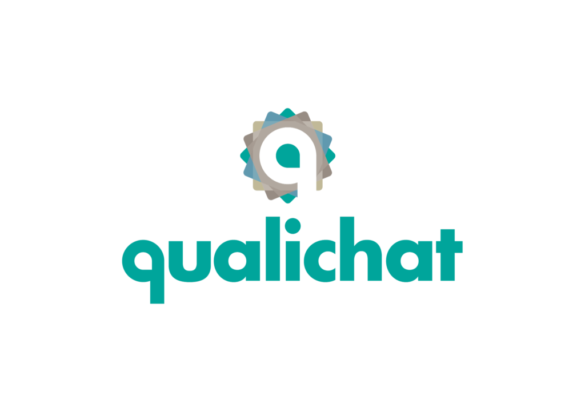

# 

<!-- badges -->
[](https://github.com/qualichat/qualichat/actions/workflows/test.yml)
[](https://pypi.org/project/qualichat/)
[](https://pypi.org/project/qualichat/)
[](LICENSE)
[](https://pepy.tech/project/qualichat)
[](https://github.com/qualichat/qualichat/stargazers)

Open-source linguistic ethnography tool for framing public opinion in mediatized groups.


## Table of Contents

- [Installing](#installing)
- [Quickstart](#quickstart)
- [Links](#links)


### Installing

**Python 3.7.1 or higher is required.**

To install the library, you can just run the following command:
```sh
$ pip install -U qualichat
```

Before using the library, it's necessary to download the Spacy language model. You can do this by running:

```sh
$ python -m spacy download en_core_web_sm
```


To install a development version, follow these steps:
```sh
$ git clone https://github.com/qualichat/qualichat
$ cd qualichat

# Linux/MacOS
$ python3 -m pip install -U .
# Windows
$ py -3 -m pip install -U .
```

## Compatibility Note
### Python 3.12 Compatibility:

As of the current release, Qualichat has been extensively tested on Python versions up to 3.11. While we strive to ensure compatibility with newer versions of Python, please note that Python 3.12 is a recent release and might have limited coverage in terms of library support and testing. As such, you may encounter unexpected issues or incompatibilities when using Qualichat with Python 3.12.

We recommend using Python 3.7.1 or higher, but not exceeding version 3.11 for the most stable experience. We appreciate any feedback or contributions regarding compatibility with newer Python versions, including Python 3.12.

### Quickstart

Qualichat parses WhatsApp chat exports across **iOS, Android and most locales**
(parsing is delegated to [`chat-miner`](https://github.com/joweich/chat-miner)).
Both `.txt` files and `.zip` archives (iOS exports with media) are accepted.

To export a chat, in WhatsApp open the conversation → menu → *Export Chat*.
Then run:

```sh
python -m qualichat load <path-to-chat-file>
```

For example:

```sh
python -m qualichat load _chat.txt
python -m qualichat load "WhatsApp Chat with Joel.zip"
python -m qualichat load chat_a.txt chat_b.txt   # several at once
```

Supported timestamp formats include (non-exhaustive):

| Platform / locale | Example |
|---|---|
| iOS (recent) | `[01/01/2021, 07:52:45] Joel: Hello!` |
| iOS (legacy) | `[01/01/2021 07:52:45] Joel: Hello!` |
| iOS (US, 12h) | `[1/1/21, 7:52:45 AM] Joel: Hello!` |
| Android (most) | `01/01/2021, 07:52 - Joel: Hello!` |
| Android (DE) | `01.01.21, 07:52 - Joel: Hallo!` |


### Links

- **Website:** http://qualichat.com
- **Documentation:** https://qualichat.readthedocs.io
- **Source code:** https://github.com/qualichat/qualichat

